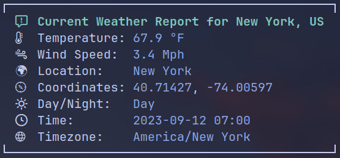

# WeatherWand



> A Rust-based command-line tool for fetching weather data from an API and
> presenting it in a beautiful and readable format.

### Note

_This is very much work in progress and the first project in my journey of
learning Rust. It probably does not follow best-practice and still has a lot of
things that can be improved in the future. When looking at this repository,
please consider that._

---

## Table of Contents

- [Introduction](#introduction)
- [Features](#features)
- [Requirements](#requirements)
- [Usage](#usage)
- [Development](#development)
- [ToDo](#todo)

---

## Introduction

WeatherWand is a command-line tool built in Rust that allows you to retrieve
weather data from an external API, deserialize the JSON response, and present it
in a user-friendly and aesthetically pleasing format in the terminal.

This project was developed with the goal of providing a simple and elegant way
to access weather information for any location and display it with clarity.

---

## Features

- Fetch geolocation & weather data from an API.
- Deserialize JSON responses.
- Display weather information in the terminal.
- Support for various units (temperature, wind speed).

---

## Requirements

- Set a [Nerd Font](https://github.com/ryanoasis/nerd-fonts) as your terminal
  font to correctly display the icons.
- Ensure a stable internet connection.

---

## Usage

```shell
weather-wand --city <CITY> --temperature-unit <TEMPERATURE_UNIT> --windspeed-unit <WINDSPEED_UNIT>
```

Example:

```shell
weather-wand -c "New York" -t fahrenheit -w mph
```

Help:

```shell
weather-wand --help
```

---

## Development

### Requirements

- [rust-clippy](https://github.com/rust-lang/rust-clippy) is used for linting.
  Please run it before every commit:

```shell
cargo clippy
```

- [rustfmt](https://github.com/rust-lang/rustfmt) is used for code formatting.
  Please run it before every commit:

```shell
cargo fmt
```

- _(optional)_ [cargo-modules](https://github.com/regexident/cargo-modules) can
  be used to display the module structure:

```shell
cargo modules generate tree
```

or

```shell
cargo modules generate tree --types
```

### Contribute

1. Clone the project repository:

```shell
git clone https://github.com/tnickel-web/weather-wand.git
```

2. Navigate to the project directory:

```shell
cd weather-wand
```

3. Run the project:

```shell
cargo run
```

4. Build for release:

- Linux:

```shell
cargo build --release
```

- Windows:

```shell
rustup target add x86_64-pc-windows-gnu

cargo build --release --target x86_64-pc-windows-gnu
```

---

## ToDo

- [x] Add build instructions to README.
- [x] Publish a release.
- [x] Add fmt instructions.
- [ ] Implement testing.
- [ ] Solve node12 vs node16 issue for Actions.
- [ ] Improve error handling so there is an error output instead of null values.
- [ ] Set a timeout for the requests so the terminal is not stuck until fetch
      has finished when there is no / a slow internet connection.
