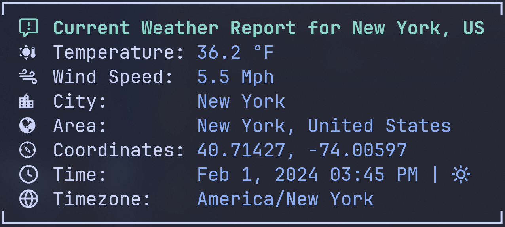

# Weather Wand



> A Rust-based command-line tool for fetching weather data from an API and
> presenting it in a beautiful and readable format.

### Note
_This is very much work in progress and the first project in my journey of learning Rust. It probably does not follow best-practice and still has a lot of things that can be improved in the future. Please consider this when looking at this repository._

---

## Table of Contents

- [Introduction](#introduction)
- [Features](#features)
- [Requirements](#requirements)
- [Usage](#usage)

---

## Introduction

WeatherWand is a command-line tool built in Rust that allows
you to retrieve weather data from an external API, deserialize the JSON
response, and present it in a user-friendly and aesthetically pleasing format in
the terminal.

This project was developed with the goal of providing a simple and elegant way
to access weather information for any location and display it with clarity.

---

## Features

- Fetch geolocation & weather data from an API.
- Deserialize JSON responses.
- Display weather information in the terminal.
- Support for various units (temperature, wind speed).

---

## Requirements

- Set a [Nerd Font](https://github.com/ryanoasis/nerd-fonts) as your terminal
  font to correctly display the icons.
- Ensure a stable internet connection.

---

## Usage

```bash
weather-wand --city <CITY> --temperature-unit <TEMPERATURE_UNIT> --windspeed-unit <WINDSPEED_UNIT>
```

Example:

```bash
weather-wand -c "New York" -t fahrenheit -w mph
```

Help:

```bash
weather-wand --help
```

---

## ToDo
- [ ] Add build instructions to README.
- [ ] Improve error handling so there is a error output instead of null values.
- [ ] Set a timeout for the requests so the terminal is not stuck until fetch has finished when there is no / a slow internet connection.
